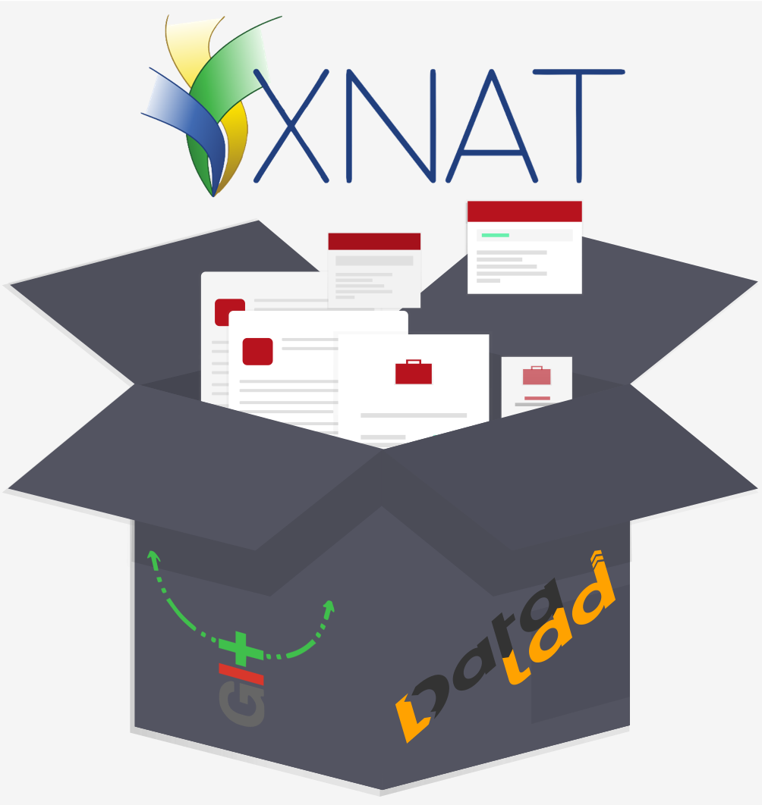

.. include:: ./links.inc

DataLad XNAT: Track and retrieve XNAT projects with DataLad
-----------------------------------------------------------

This is documentation for the `DataLad extension <handbook.datalad.org/en/latest/r.html?extensions>`_, ``datalad-xnat``, that equips DataLad_ with additional functionality to work with XNAT_ servers.
Use it to [COMPLETE ME]

The extension was created during the `Juelich Brain Hackathon 2021 <http://www.csn.fz-juelich.de/inmibi2021/brain-hackathon/>`_ and wouldn't have been possible without a `dedicated team of volunteers <https://github.com/datalad/datalad-xnat#contributors->`_.
If you want to get in touch or on board as well, please see our :ref:`contributing guidelines <contribute>`.

Documentation overview
^^^^^^^^^^^^^^^^^^^^^^

.. toctree::
   :maxdepth: 2

   intro
   settingup
   tutorial
   contributing
   acknowledgements
   glossary
   tutorial/walk-through_connectomeDB

.. toctree::
   :maxdepth: 1

   cmd
   api

Indices and tables
^^^^^^^^^^^^^^^^^^

* :ref:`genindex`
* :ref:`modindex`
* :ref:`search`

.. |---| unicode:: U+02014 .. em dash
